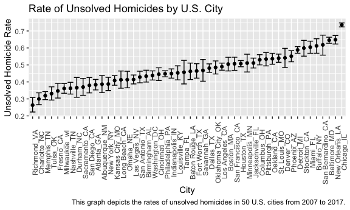
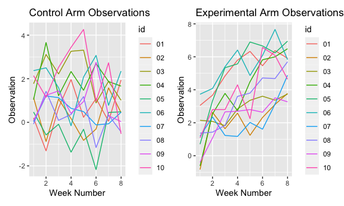
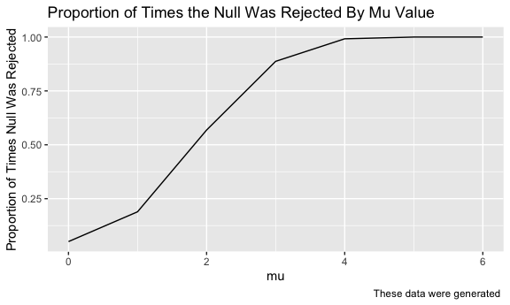
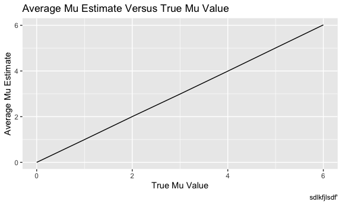
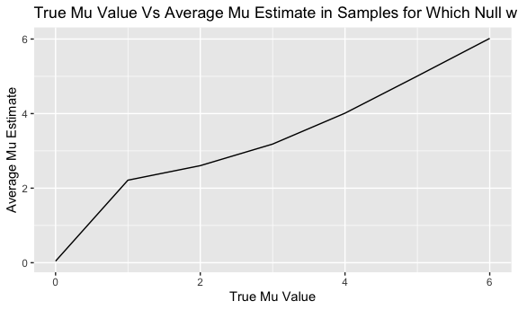

Data Science HW 5
================
Caroline Andy
11/15/2020

### Problem 1

``` r
library(purrr)
library(tidyverse)
library(stringr)
library(patchwork)

knitr::opts_chunk$set(
  fig.width = 6,
  fig.asp = .6,
  out.width = "90%"
)
```

For this problem, I will use a Washington Post dataset containing
homicide data for 50 U.S. cities from 2007 to 2017. This dataset
contains the following relevant variables: state, city, reported date,
victim demographic and identifiable information, and case disposition. I
will use the below code to summarize the number of solved, unsolved and
total homicide cases by city.

``` r
#generate homicide table and summarize solved and unsolved murders by state
urlfile = "https://raw.githubusercontent.com/washingtonpost/data-homicides/master/homicide-data.csv"
homicide = read_csv(url(urlfile)) %>%
  mutate(city_state = str_c(city, state, sep = "_")) %>%
  mutate(outcome = case_when(disposition %in% "Closed without arrest" ~ "unsolved",
                             disposition %in% "Closed by arrest" ~ "solved", 
                             disposition %in% "Open/No arrest" ~ "unsolved")) %>%
  filter(city_state != "Tulsa_AL") %>%
  group_by(city_state, outcome) %>%
  summarize(n_obs = n())
```

Now I will use the prop.test() function to estimate the proportion of
homicides that are unsolved in Baltimore, MD.

``` r
# prop test for Baltimore
baltimore = homicide %>%
  filter(city_state == "Baltimore_MD") %>%
  pivot_wider(names_from = "outcome", values_from = "n_obs") %>%
  mutate(total = solved + unsolved)

baltimore_test = prop.test(x = baltimore$unsolved, n = baltimore$total) %>%
  broom::tidy() %>%
  select(estimate, conf.low, conf.high) %>%
  mutate(conf_int = paste(round(conf.low, 6), sep = " - ", round(conf.high, 6))) %>%
  select(estimate, conf_int)

baltimore_test
```

    ## # A tibble: 1 x 2
    ##   estimate conf_int          
    ##      <dbl> <chr>             
    ## 1    0.646 0.627562 - 0.66316

Now I will generate and extract both the proportion of unsolved
homicides and the confidence interval for each of the cities in the
homicide dataset.

``` r
# prop test for all cities
results_df = homicide %>%
  pivot_wider(names_from = "outcome", values_from = "n_obs") %>%
  mutate(total = solved + unsolved) %>%
  mutate(prop_test = map2(.x = unsolved, .y = total, ~prop.test(x = .x, n = .y)),
  tidy_tests = map(.x = prop_test, ~broom::tidy(.x))) %>%
  select(-prop_test) %>% 
  unnest(tidy_tests) %>% 
  select(city_state, estimate, conf.low, conf.high)

results_df
```

    ## # A tibble: 50 x 4
    ## # Groups:   city_state [50]
    ##    city_state     estimate conf.low conf.high
    ##    <chr>             <dbl>    <dbl>     <dbl>
    ##  1 Albuquerque_NM    0.386    0.337     0.438
    ##  2 Atlanta_GA        0.383    0.353     0.415
    ##  3 Baltimore_MD      0.646    0.628     0.663
    ##  4 Baton Rouge_LA    0.462    0.414     0.511
    ##  5 Birmingham_AL     0.434    0.399     0.469
    ##  6 Boston_MA         0.505    0.465     0.545
    ##  7 Buffalo_NY        0.612    0.569     0.654
    ##  8 Charlotte_NC      0.300    0.266     0.336
    ##  9 Chicago_IL        0.736    0.724     0.747
    ## 10 Cincinnati_OH     0.445    0.408     0.483
    ## # … with 40 more rows

I will now generate a plot showing the proportion estimates and
confidence intervals for each city.

``` r
results_df %>%
  ungroup() %>%
  mutate(city_state = fct_reorder(city_state, estimate)) %>%
  ggplot(aes(x = city_state, y = estimate)) + 
  geom_point() +
  geom_errorbar(aes(ymin = conf.low, ymax = conf.high)) +
  labs(
    title = "Rate of Unsolved Homicides by U.S. City",
    x = "City",
    y = "Unsolved Homicide Rate",
    caption = "This graph depicts the rates of unsolved homicides in 50 U.S. cities from 2007 to 2017."
  ) +
  theme(axis.text.x = element_text(angle = 90))
```



``` r
view(results_df)
```

As we can see from the above graph, the city with the lowest rate of
unsolved homicides is Richmond, Virginia; the city with the highest rate
of unsolved homicides is Chicago, Illinois.

### Problem 2

For this problem, I will use a folder of data containing weekly
observation measurements for 20 subjects participating in a longitudinal
clinical trial. 10 of these subjects are enrolled in the experimental
arm, while 10 are enrolled in the control arm.

I will first create a tidy dataframe containing data from all
participants, including the subject ID, arm, and observations over time.

``` r
path_df = 
  tibble(
    path = list.files("data"))

path_df = path_df %>%
  mutate(
    path = str_c("data/", path),
    study_data = map(.x = path, ~read_csv(.x))) %>%
  unnest(study_data) %>%
  pivot_longer(
    week_1:week_8,
    names_to = "week",
    values_to = "observation") %>%
  mutate(
    week = as.numeric(str_replace(week, "week_", "")),
    arm = str_extract(path, "/[a-z][a-z][a-z]"),
    arm = str_remove(arm, "/"),
    id = str_extract(path, "[0-9]+")) %>%
  select(-path)

path_df
```

    ## # A tibble: 160 x 4
    ##     week observation arm   id   
    ##    <dbl>       <dbl> <chr> <chr>
    ##  1     1        0.2  con   01   
    ##  2     2       -1.31 con   01   
    ##  3     3        0.66 con   01   
    ##  4     4        1.96 con   01   
    ##  5     5        0.23 con   01   
    ##  6     6        1.09 con   01   
    ##  7     7        0.05 con   01   
    ##  8     8        1.94 con   01   
    ##  9     1        1.13 con   02   
    ## 10     2       -0.88 con   02   
    ## # … with 150 more rows

Now I will make a spaghetti plot showing observations for each subject
over the 8 week study period.

``` r
path_df %>%
  ggplot(aes(x = week, y = observation, color = id, linetype = arm)) + 
  geom_line() +
  labs(
    title = "Observations for Each Subject by Week",
    x = "Week Number",
    y = "Observation",
    caption = "Data from subjects enrolled in a longitudinal study. \nSubjects 01 through 05 were enrolled in the control arm, \nand subjects 06 through 10 in the experimental arm"
  )
```


From the above graph, we can clearly see that subjects participating in
the experimental study arm had higher observation measurements than
subjects participating in the control study arm. We can visualize the
weekly study results separately by study arm:

``` r
con = path_df %>%
  filter(arm == "con") %>%
  ggplot(aes(x = week, y = observation, color = id)) + 
  geom_line() +
  labs(
    title = "Control Arm Observations",
    x = "Week Number",
    y = "Observation"
  )

exp = path_df %>%
  filter(arm == "exp") %>%
  ggplot(aes(x = week, y = observation, color = id)) + 
  geom_line() +
  labs(
    title = "Experimental Arm Observations",
    x = "Week Number",
    y = "Observation"
  )

con + exp
```



After separating the data by study arm, we can see that subjects
enrolled in the experimental arm not only have overall higher
observations than subjects enrolled in the control arm, but they also
see increases in measurements over the course of the 8 week study
period. Subjects enrolled in the control arm have no discernible trend
in measurements overtime.

### Problem 3

In this problem, I will conduct a simulation to explore power in a
simple linear regression. I will generate 5000 datasets, each with size
n = 30 and standard deviation = 5, for mu values = 0, 1, 2, 3, 4, 5 and
6.

``` r
set.seed(1)

sim_mean_sd = function(mu) {
  
    x = rnorm(n = 30, mean = mu, sd = 5)
  
  t.test(x = x, mu = 0, alternative = "two.sided") %>%
    broom::tidy() %>%
    select(estimate, p.value)
}

results = tibble(
  mu = c(0, 1, 2, 3, 4, 5, 6)) %>%
  mutate(output_lists = map(.x = mu, ~rerun(5000, sim_mean_sd(mu = .x)))) %>%
  unnest(output_lists) %>%
  unnest(output_lists) %>%
  mutate(reject_null = if_else(p.value > 0.05, 0, 1))
```

Now I will make a plot showing the true value of mu on the x axis versus
the proportion of times the null was rejected (the power of the test) on
the y axis.

``` r
results %>%
  group_by(mu) %>%
  summarize(prop_rej = sum(reject_null)/5000) %>%
  ggplot(aes(x = mu, y = prop_rej)) +
  geom_line() +
  labs(
    title = "Proportion of Times the Null Was Rejected By Mu Value",
    x = "mu",
    y = "Proportion of Times Null Was Rejected",
    caption = "These data were generated "
  )
```

 As we
can see in the above graph, as the true mu (effect size) increases, the
proportion of times the null was rejected (or power) also increases. The
proportion is near 0 when the true mu = 0. As the true mu increases, the
proportion of rejections also increases.

Now I will create a plot showing the average estimate of mu on the y
axis and the true value of mu on the x axis.

``` r
avg_true = results %>%
  group_by(mu) %>%
  summarize(mean_mu_hat = mean(estimate)) %>%
  ggplot(aes(x = mu, y = mean_mu_hat)) + 
  geom_line() +
  labs(
    title = "Average Mu Estimate Versus True Mu Value",
    x = "True Mu Value",
    y = "Average Mu Estimate",
    caption = "sdlkfjlsdf'"
  )

avg_true
```



Now I will make a second plot showing the true mu value versus the
average estimate of mu hat only in samples for which the null was
rejected.

``` r
avg_mu_hat_vs_true_mu = results %>%
  filter(reject_null == 1) %>%
  group_by(mu) %>%
  summarize(mean_mu_hat = mean(estimate)) %>%
  ggplot(aes(x = mu, y = mean_mu_hat)) + 
  geom_line() + 
  labs(
    title = "True Mu Value Vs Average Mu Estimate in Samples for Which Null was Rejected",
    x = "True Mu Value",
    y = "Average Mu Estimate"
  )

avg_mu_hat_vs_true_mu
```



Among tests in which the null hypothesis is rejected, the sample average
of mu hat across tests is approximately equal to the true value of mu.
This is trend is particularly apparent for mu = 4, mu = 5 and mu = 6.
This result is expected, since when the null (mu = 0) is rejected, the
estimate is closer to the true mu.
